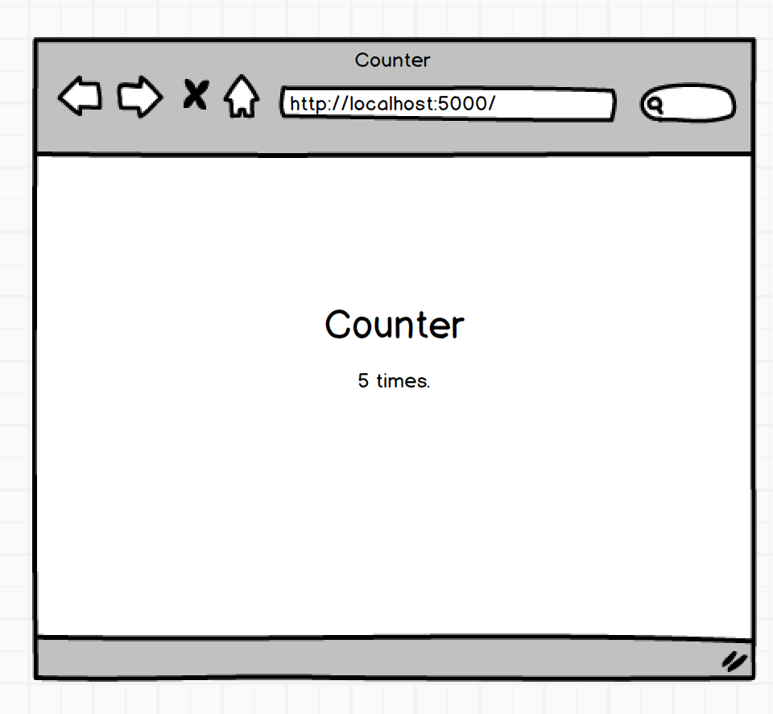

# Counter_Python
Step1: 
Build a flask application that counts the number of times the root route ('/') has been viewed. 

Step2: 
Add a +2 button underneath the counter that reloads the page and increments counter by 2. 

Step3: 
Add a reset button that resets the counter back to 1. 

